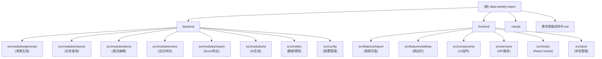

# 数据周报自动化系统 - AI 上下文文档

> **最后更新**: 2026-01-23
> **项目状态**: 🟡 开发中（阶段 1 约 70% 完成）
> **技术栈**: NestJS 10 + React 18 + TypeORM 0.3 + SQLite + PostgreSQL

---

## 📋 变更记录 (Changelog)

### 2026-01-23

- 🔄 重新扫描项目结构并生成全新 AI 上下文文档
- ✅ 完成项目架构分析与模块识别
- ✅ 生成根级与模块级文档索引
- 📊 统计项目文件与代码规模

### 2026-01-16
- 初始化 AI 上下文文档
- 完成项目结构扫描与模块识别

---

## 🎯 项目愿景

构建一套**自动化数据周报管理系统**
,解决手工统计耗时、口径不统一及历史追溯难的问题。系统实现多源数据（Jira、PostgreSQL、人工）的自动化聚合，提供快照式的版本管理与编辑功能，并支持一键导出标准格式
Excel 周报。

**核心价值**：

- ⚡ **自动化数据聚合**：减少 80% 手工统计时间
- 📸 **快照式版本管理**：确保历史数据可追溯
- 🔗 **多源数据整合**：Jira + 数据库 + 人工录入
- 📊 **标准化 Excel 导出**：符合部门规范

---

## 🏗️ 架构总览

### 技术架构

**后端 (Backend)**：

- **框架**: NestJS 10.x + TypeScript 5.3
- **ORM**: TypeORM 0.3.x
- **数据库**: SQLite (WAL 模式) + PostgreSQL (外部数据源)
- **ID 生成**: Snowflake 算法（64 位分布式 ID）
- **Excel 处理**: ExcelJS 4.4
- **HTTP 客户端**: Axios 1.6
- **数据验证**: class-validator + class-transformer
- **配置管理**: js-yaml + zod

**前端 (Frontend)**：

- **框架**: React 18.3 + TypeScript 5.3
- **构建工具**: Vite 7.x
- **UI 库**: Ant Design 5.x
- **路由**: React Router DOM 6.x
- **状态管理**: Zustand 4.5 (UI) + React Query 5.x (数据)
- **数据处理**: Immer 10.x + lodash-es
- **日期处理**: dayjs 1.11

**数据流**：
```
用户触发生成 → 后端计算周期 → 并发拉取数据（Jira + PostgreSQL）
→ 数据转换与映射 → 单事务写入 4 张表 → 返回新周报 ID → 前端自动跳转
```

### 模块结构图



---

## 📂 模块索引

| 模块路径                             | 职责描述                     | 技术栈                       | 状态     | 文档链接                         |
|----------------------------------|--------------------------|---------------------------|--------|------------------------------|
| [backend](./backend/CLAUDE.md)   | 后端服务：周报生成、数据聚合、API 提供    | NestJS + TypeORM + SQLite | 🟡 70% | [查看详情](./backend/CLAUDE.md)  |
| [frontend](./frontend/CLAUDE.md) | 前端应用：周报编辑、可视化展示、Excel 导出 | React + Ant Design + Vite | 🟡 40% | [查看详情](./frontend/CLAUDE.md) |
| .claude                          | 项目规划与配置文档                | Markdown                  | ✅ 完成   | -                            |

---

## 📊 项目统计

### 代码规模

- **后端源文件**: 40 个 TypeScript 文件
- **前端源文件**: 37 个 TypeScript/TSX 文件
- **总计**: 77 个源代码文件（不含 node_modules）

### 模块分布

- **后端模块**: 6 个业务模块 + 2 个基础模块
    - generate (周报生成)
    - reports (历史查询)
    - items (条目编辑)
    - notes (会议待办)
    - export (Excel 导出)
    - id (ID 生成)
    - config (配置管理)
    - entities (数据模型)

- **前端模块**: 2 个功能模块 + 4 个基础模块
    - features/report (周报页面)
    - features/sidebar (侧边栏)
    - components (UI 组件)
    - services (API 服务)
    - hooks (React Hooks)
    - store (状态管理)

---

## 🚀 运行与开发

### 环境要求
- Node.js >= 18.0.0
- npm >= 9.0.0

### 快速启动

**1. 安装依赖**
```bash
# 后端依赖
cd backend
npm install

# 前端依赖
cd ../frontend
npm install
```

**2. 配置文件**
```bash
cd backend/config
cp app.yaml.example app.yaml
# 编辑 app.yaml，填入 Jira 凭证和数据库连接信息
```

**3. 初始化数据库**
```bash
cd backend
npm run migration:run
```

**4. 启动开发服务器**
```bash
# 后端（端口 3000）
cd backend
npm run start:dev

# 前端（端口 5173）
cd frontend
npm run dev
```

访问：http://localhost:5173

### 常用命令

**后端**：

- `npm run start:dev` - 开发模式启动（热重载）
- `npm run build` - 生产构建
- `npm run start:prod` - 生产模式启动
- `npm run migration:generate -- -n <名称>` - 生成 Migration
- `npm run migration:run` - 运行 Migration
- `npm run migration:revert` - 回滚 Migration

**前端**：

- `npm run dev` - 开发模式启动（热重载）
- `npm run build` - 生产构建
- `npm run preview` - 预览生产构建
- `npm run lint` - 代码检查
- `npm run type-check` - 类型检查

---

## 🧪 测试策略

### 当前状态

- ❌ **单元测试**：未实施
- ❌ **集成测试**：未实施
- ✅ **手动测试**：基础功能验证

### 计划测试覆盖
1. **后端单元测试**（优先级：高）
   - IdService：Snowflake ID 生成与解析
   - JiraAdapter：API 调用与数据标准化
   - SqlAdapter：数据库连接与查询
   - GenerateService：周报生成核心逻辑

2. **前端单元测试**（优先级：中）
    - 组件测试：MetricCard、StackedProgress、TreeTable
    - Hook 测试：useGenerate、useReports、useItems
   - Store 测试：uiStore

3. **端到端测试**（优先级：低）
   - 完整周报生成流程
   - 编辑与保存流程
   - Excel 导出验证

---

## 📝 编码规范

### 命名约定
- **数据库**：snake_case（表名、字段名）
- **TypeScript**：camelCase（变量、函数）、PascalCase（类、接口、类型）
- **文件名**：kebab-case（组件文件）、camelCase（工具函数）
- **React 组件**：PascalCase（文件名与组件名）

### 代码风格
- **后端**：遵循 NestJS 官方风格指南
- **前端**：遵循 Airbnb React/TypeScript 风格指南
- **格式化**：Prettier（后端已配置）
- **Lint**：ESLint（前后端已配置）

### 关键约束
1. **ID 类型**：所有主键使用 BIGINT（数据库）+ String（API 传输）
2. **ID 生成**：必须通过 IdService.nextId() 生成，禁止手动赋值
3. **事务管理**：涉及多表写入必须使用 TypeORM 事务
4. **错误处理**：使用 NestJS 内置异常类（BadRequestException、NotFoundException 等）
5. **类型安全**：禁止使用 any，必须明确类型定义
6. **BIGINT 序列化**：所有 ID 在 API 层自动转为 String（通过 BigIntToStringInterceptor）

---

## 🗄️ 数据库设计

### 表结构

| 表名             | 说明    | 关键字段                                                                      | 索引                                                                          |
|----------------|-------|---------------------------------------------------------------------------|-----------------------------------------------------------------------------|
| reports        | 报告主表  | id, week_range, week_number, created_at, is_deleted                       | idx_reports_is_deleted_created_at                                           |
| system_metrics | 系统指标表 | id, report_id, metric_key, metric_value, status_code                      | idx_system_metrics_report_id, uniq_system_metrics_report_key                |
| report_items   | 报表条目表 | id, report_id, tab_type, source_type, parent_id, content_json, sort_order | idx_report_items_report_tab, idx_report_items_parent, idx_report_items_sort |
| meeting_notes  | 会议待办表 | id, report_id, content                                                    | idx_meeting_notes_report_id                                                 |

### 关系图

```
reports (1) ----< (N) system_metrics
reports (1) ----< (N) report_items
reports (1) ----< (N) meeting_notes
report_items (1) ----< (N) report_items (自关联，树形结构)
```

### 索引策略

- **reports**: idx_reports_is_deleted_created_at（软删除 + 时间排序）
- **system_metrics**: idx_system_metrics_report_id, uniq_system_metrics_report_key（唯一约束）
- **report_items**: idx_report_items_report_tab, idx_report_items_parent, idx_report_items_sort
- **meeting_notes**: idx_meeting_notes_report_id

---

## 🔌 核心 API

### 周报生成
- **POST** `/api/generate`
- **请求体**：`{ weekRange?: string, weekNumber?: number }`
- **响应**：完整周报数据（包含 metrics、items、notes）

### 周报查询

- **GET** `/api/reports` - 获取历史周报列表
- **GET** `/api/reports/:id` - 获取指定周报详情

### 条目编辑

- **PATCH** `/api/items/:id` - 更新单行条目
- **PUT** `/api/reports/:id/manual-items` - 全量更新自采数据

### 会议待办

- **PATCH** `/api/notes/:report_id` - 更新会议待办

### Excel 导出

- **GET** `/api/reports/:id/export` - 导出 Excel

### 健康检查

- **GET** `/api/generate/health` - 所有依赖服务的健康状态（Jira、PostgreSQL、SQLite）

---

## ⚠️ 已知问题与限制

### 阻塞问题
1. ✅ **已解决**：数据库 Migration 已创建
2. ⚠️ **待验证**：WAL 模式配置是否生效
3. ⚠️ **待验证**：Jira API 连接是否正常（需真实凭证）

### 功能限制

1. **前端页面未完成**：部分编辑器组件功能不完整
2. **Excel 导出未实现**：ExcelJS 集成待开发
3. **权限控制缺失**：当前无用户认证与授权机制
4. **错误处理不完善**：缺少全局错误边界与友好提示

### 性能考虑
1. **大数据量**：单次 Jira 查询限制 1000 条，需分页处理
2. **并发写入**：SQLite WAL 模式支持读写并发，但写写互斥
3. **前端渲染**：大表格需考虑虚拟滚动（未实现）

---

## 🗺️ 下一步计划

### 阶段 2：核心模块完善（优先级：高）

- [ ] 完善 Reports 模块（历史版本查询、删除）
- [ ] 完善 Items 模块（单行编辑、批量更新）
- [ ] 完善 Notes 模块（会议待办保存）
- [ ] 完善错误处理与日志记录

### 阶段 3：前端核心功能（优先级：高）

- [ ] 完善版本选择器组件
- [ ] 完善指标看板（3 个卡片）
- [ ] 完善 Tab 编辑器（DONE、SELF、PLAN）
- [ ] 完善会议待办侧边栏

### 阶段 4：Excel 导出（优先级：中）
- [ ] 基于模板的 Excel 生成
- [ ] 树形数据格式化（缩进 + 样式）
- [ ] 4 个 Sheet 页生成

### 阶段 5：测试与优化（优先级：中）
- [ ] 单元测试覆盖核心逻辑
- [ ] 集成测试验证完整流程
- [ ] 性能优化（查询、渲染）

### 阶段 6：生产部署（优先级：低）
- [ ] Docker 容器化
- [ ] CI/CD 流水线
- [ ] 监控与告警

---

## 📚 AI 使用指引

### 项目上下文理解

**核心概念**：

- **快照模式**：每次生成的周报是独立版本，修改不影响历史
- **多源聚合**：Jira（任务数据）+ PostgreSQL（ETL 指标）+ 人工录入
- **树形结构**：自采数据 Tab 支持主任务-子任务两层结构
- **BIGINT 序列化**：所有 ID 在 API 层自动转为 String

**关键文件**：

- 数据模型：`backend/src/entities/*.entity.ts`
- 业务逻辑：`backend/src/modules/generate/generate.service.ts`
- API 定义：`backend/src/modules/*/**.controller.ts`
- 前端类型：`frontend/src/types/*.ts`
- 前端页面：`frontend/src/features/report/*.tsx`

### 常见任务指引

**1. 添加新的 API 端点**

```bash
# 后端
cd backend
nest g controller modules/<模块名>
nest g service modules/<模块名>

# 前端
# 在 frontend/src/services/ 添加对应的 API 服务类
# 在 frontend/src/types/ 添加类型定义
```

**2. 修改数据库结构**

```bash
cd backend
npm run migration:generate -- -n <变更描述>
# 检查生成的 Migration 文件
npm run migration:run
```

**3. 添加新的前端页面**

```bash
# 在 frontend/src/features/ 创建功能模块
# 在 frontend/src/components/ 创建 UI 组件
# 在 frontend/src/App.tsx 添加路由
```

### 调试技巧

**后端调试**：

- 启用日志：修改 `typeorm.config.ts` 中的 `logging` 选项
- 健康检查：访问 `http://localhost:3000/api/generate/health`
- 数据库查看：使用 SQLite 客户端打开 `backend/data/weekly-report.sqlite`

**前端调试**：

- React Query DevTools：已集成，开发模式自动显示
- Zustand DevTools：可通过浏览器扩展查看状态
- Network 面板：查看 API 请求与响应

---

## 📖 参考文档

- [需求规格说明书](./数据周报自动化系统%20-%20需求规格说明书.md)
- [后端模块文档](./backend/CLAUDE.md)
- [前端模块文档](./frontend/CLAUDE.md)
- [NestJS 官方文档](https://docs.nestjs.com/)
- [React 官方文档](https://react.dev/)
- [Ant Design 组件库](https://ant.design/)
- [TypeORM 文档](https://typeorm.io/)

---

**文档生成时间**: 2026-01-23
**文档版本**: V2.0
**维护者**: AI Assistant
